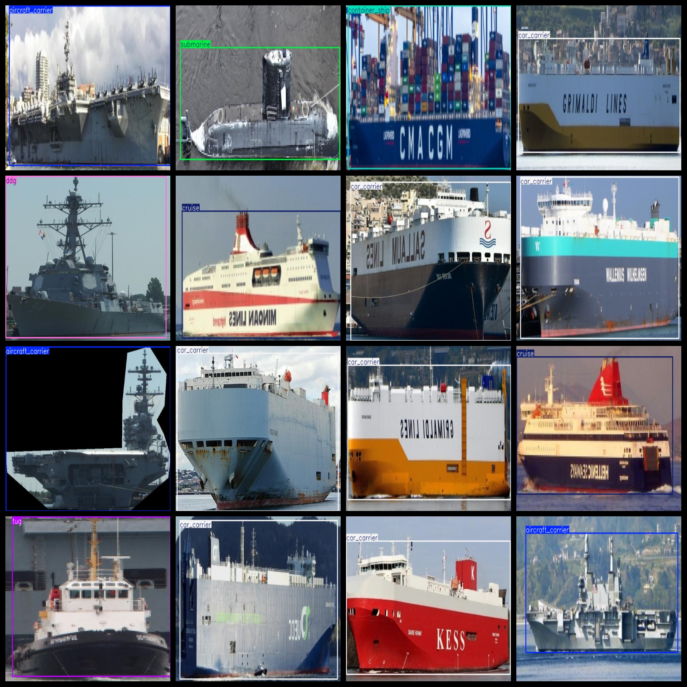
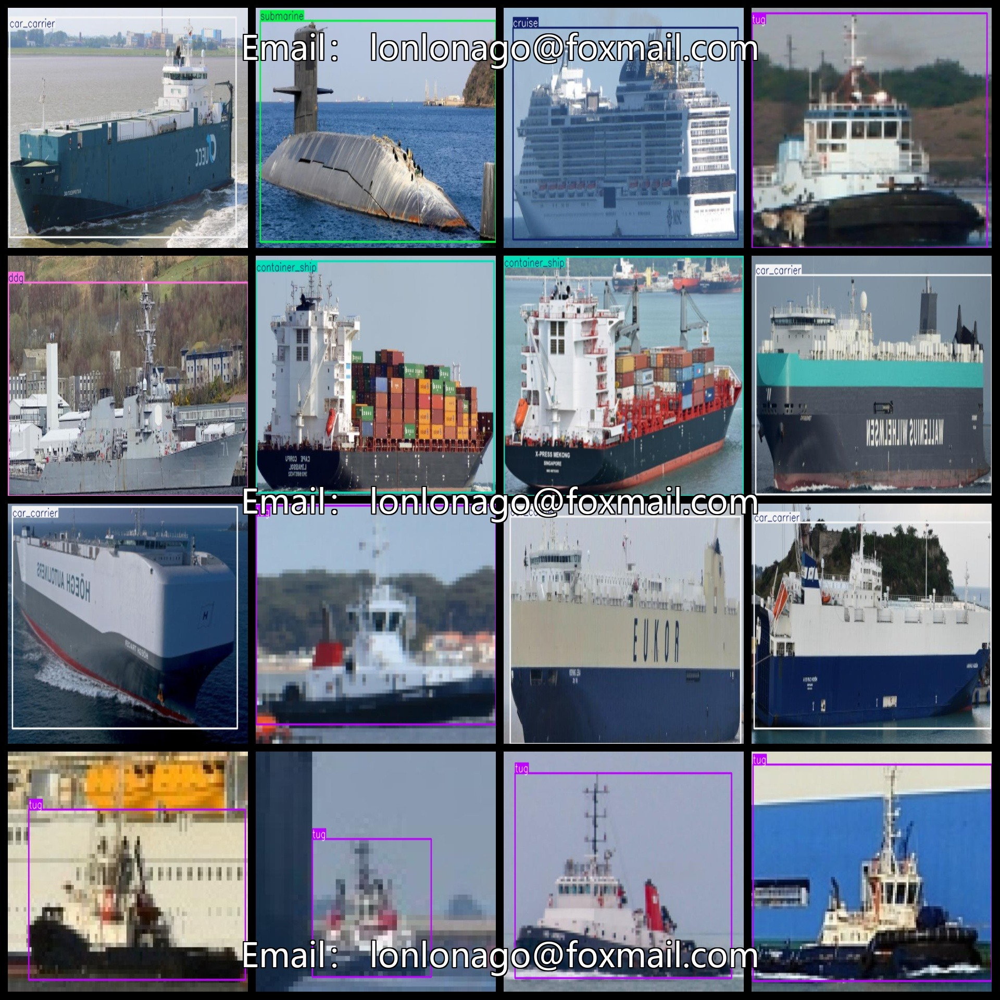
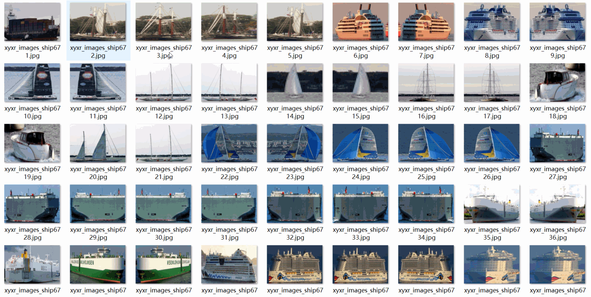

# [Object Detection] Military and Civilian Ship Classification Detection Dataset 6057 images10-classYOLO+VOC（(Augmented) ）

Dataset Format: Pascal VOC + YOLO (excluding the split-path txt file; only jpg images with corresponding VOC-format xml files and YOLO-format txt files)

The compressed file contains: three folders, each storing images, xml files, and text files.

The total number of jpg images in the JPEGImages folder is 6057.

Total number of XML files in the Annotations folder: 6057

The total number of .txt files in the labels folder: 6057.

Number of tag types: 10

Tags: ['aircraft_carrier', 'bulkers', 'car_carrier', 'container_ship', 'cruise', 'ddg', 'recreational', 'sailboat', 'submarine', 'tug']

The number of boxes for each label (Note that the order of labels in the Yolo format does not correspond to this, but is based on the classes.txt file in the labels folder):

【】【"Aircraft Carriers"】【690】

Bulkers Frames = 200 (Bulk Carrier)

Car carriers = 1606 (carriage of vehicles)

Container Ship Frame Count = 720 (container ship)

Cruise frame number = 706 (Cruiser)

The DDG is a type of destroyer.

Recreational Frames = 41 (Yacht)

Sailboats = 149

Submarine frame count = 697 (submarine)

Tug Frames = 655 (Towboat)

Total frames: 6252

Picture clarity (Resolution: Pixels): Clear

Image Enhancement: Yes

Shape of the label: Rectangular box, used for object detection and recognition.

Important Note: None

Special Notice: This dataset does not guarantee the accuracy or precision of the trained models or weight files. The dataset only provides accurate and reasonable annotations.

Preserve the original meaning, format markers (【】『』「」<>[]), numbers, English words, and special characters as-is. Output ONLY the English translation, no explanations, no quotes.
## Images

---

Here is a pay link on Stripe (https://buy.stripe.com/3cs8yP7sY87d0vu9AB). Please contact me lonlonago@foxmail.com after funding $89, and I will send you a complete data files, thank you!

